# 🌐 Azure Global Infrastructure with Terraform & Ansible
⚠️ Note: At the start, I mistakenly began creating resources directly instead of modularizing them. After researching best practices, I refactored the project using a modular Terraform architecture for scalability, clarity, and reuse. This evolution reflects my learning process and my commitment to clean infrastructure-as-code.

## 📖 Overview
This project automates the deployment of a **multi-region Azure infrastructure** using **Terraform** and configures the environment using **Ansible**.  
It follows a **hub-and-spoke** topology across **West Europe (Hub)**, **France Central**, and **East US**, with **Azure Traffic Manager** providing global load balancing.

---

## 🛠️ Technologies Used

  
  

---

## 🚀 Terraform Infrastructure

### ✅ Highlights

- Modular **Terraform** architecture following best practices
- Deployed **over 50 components** using Terraform
- Modular **Ansible Roles** created for offline Nginx deployment
- **Hub-and-Spoke** topology with **West Europe (Hub)**, **France Central**, and **East US** regions
- **Multi-region deployment**: **West Europe (Hub)**, **France Central**, **East US**
- **Azure Traffic Manager** for global load balancing across regions
- **Offline installation** of Nginx on web servers without internet access
- **Dedicated Bastion Host** for secure remote access to private subnets
- **Web servers are not accessible publicly**, ensuring security through private IPs

---

### 📊 Terraform Graph
Generated using `terraform graph | dot -Tpng`:
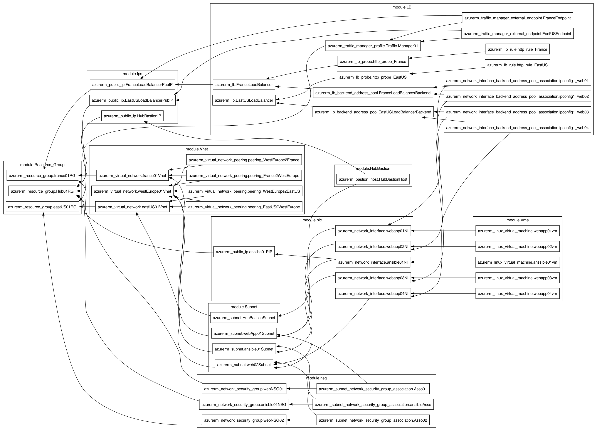

---

### 🌍 Regional Deployment Screenshots

#### 🟦 West Europe (Hub)
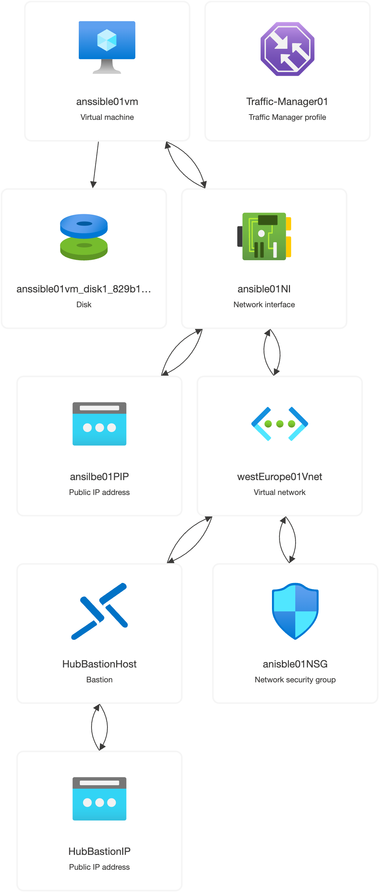

#### 🇫🇷 France Central

#### 🇺🇸 East US
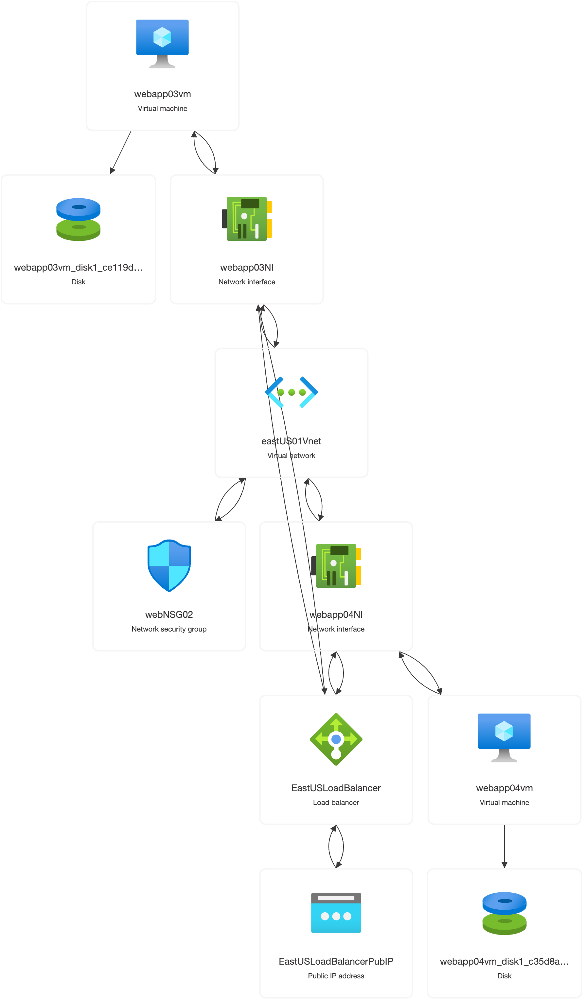

---

## 🧪 Terraform Commands

### Initialize Terraform
terraform init

### Preview changes
terraform plan

### Apply infrastructure
terraform apply

### Clean The infrastructure
terraform Destroy

# 🛠 Ansible Nginx Offline Deployment with Azure Traffic Manager

This part of the project demonstrates how to securely deploy Nginx on multiple web servers using Ansible, with no internet access on the target VMs. It also integrates Azure Load Balancer and Traffic Manager for global traffic distribution.

---

## 🔧 Setup Overview

We download all required `.deb` packages on the Ansible host and transfer them offline to web servers without internet access.

## ⚙️ Environment Preparation

1. **Install Ansible** on the Ansible host.
2. **Configure SSH Access**: Copy the SSH public key to each target VM.
3. **Clone the repository** containing the playbook and roles.
4. **Install Dependencies** (on Ansible host):
    sudo apt install apt-rdepends -y

5. **Download Nginx dependencies** (for offline use):
    apt download $(apt-rdepends nginx nginx-common | grep -v "^ " | grep -v "debconf-2.0" | sort -u)

6. Place all `.deb` files in:
    files/nginx01/nginx-debs/

---

## ✅ Playbook Testing

Test the playbook on a local test VM:

    ansible-playbook -i hosts playbook.yaml --ask-become-pass

Test Execution:
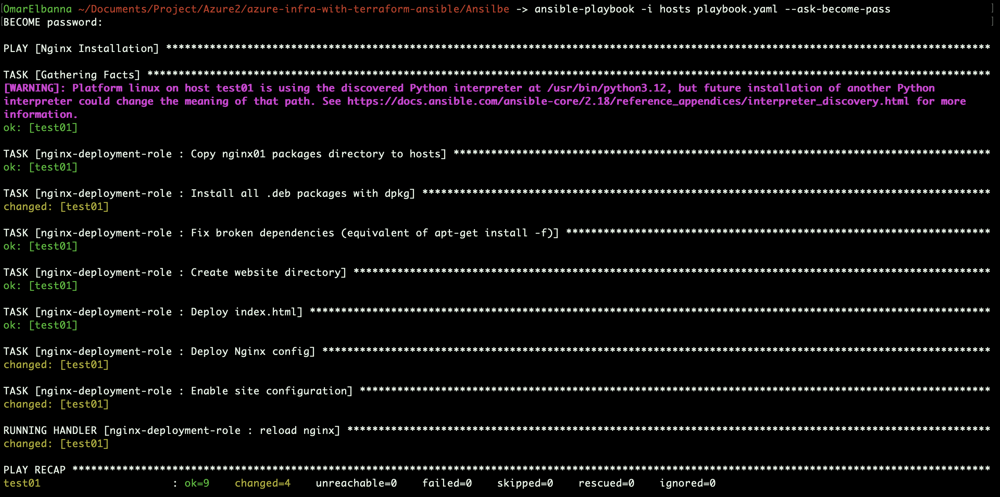

---

## 🚀 Deploy to Offline Web Servers

After transferring all dependency `.deb` files:

    ansible-playbook -i hosts playbook.yaml

Full Playbook Run:
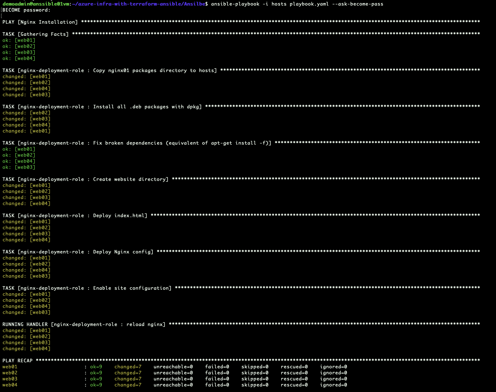

---

## 🌐 Azure Traffic Manager + Load Balancer Integration

### Issue Noticed

Initially, the Traffic Manager failed to route correctly. After troubleshooting, it was discovered that the Load Balancer rule **did not include the backend pool ID**. Adding it fixed the issue.

---

## 🔍 Traffic Manager Testing

### From Egypt (Default Region → France)

Traffic Manager routed traffic to the France region based on proximity.

- web01 (France):
  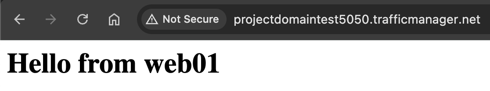

- After stopping web01:
  - web01 stopped:
    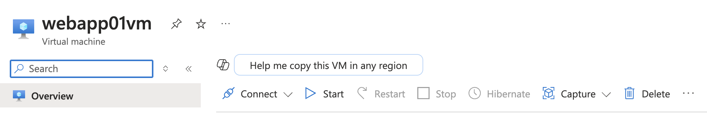
  - web02 handled traffic:
    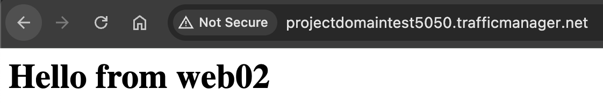

---

### From USA (via VPN → East US)

Switching to a US VPN rerouted traffic to the East US region.

- VPN active:
  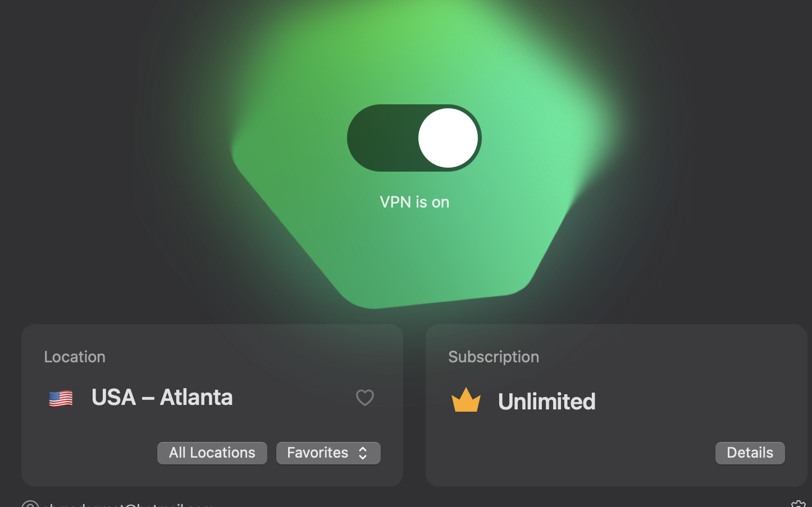

- web03 (East US):
  

- After stopping web03:
  - web03 stopped:
    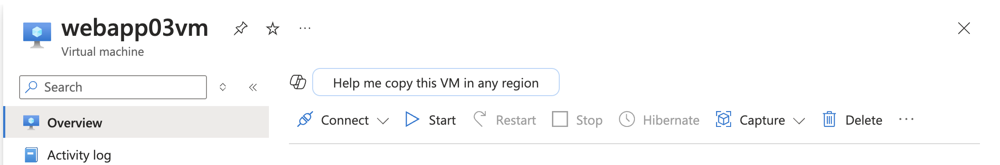
  - web04 handled traffic:
    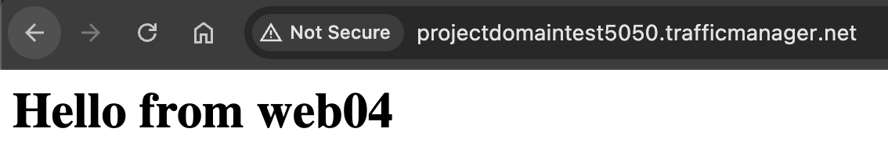

---

## 🧾 Conclusion

This project showcases a fully automated and scalable **multi-region infrastructure on Azure**, combining the power of **Terraform** for provisioning and **Ansible** for configuration management.

- 🌍 **Global Reach**: With a hub-and-spoke topology and Traffic Manager, traffic is intelligently routed to the nearest region for optimal performance.
- 🔐 **Security-First**: Infrastructure is provisioned with private subnets, NSGs, and a Bastion host to ensure secure access.
- 🚫 **Offline Compatibility**: Ansible was used to deploy and configure Nginx on web servers without internet access by preparing and transferring dependencies offline.
- ⚙️ **Modular Design**: Both Terraform and Ansible follow modular patterns, allowing reuse and easy scalability.

---

## 📈 Future Improvements

- 🔐 **Enable HTTPS** with SSL certificates and integrate Azure Key Vault for secure management.
- 🧠 **Add Application Gateway or Azure Front Door** to enable WAF, SSL offloading, URL-based routing, and more intelligent traffic control.
- 📊 **Implement CI/CD pipelines** for Terraform and Ansible to improve automation and version control.
- 📡 **Expand Monitoring** with Azure Monitor, Log Analytics, and custom health probes for full observability.

This setup lays a solid foundation for enterprise-ready, globally distributed cloud applications, and provides an excellent template for infrastructure-as-code best practices.
